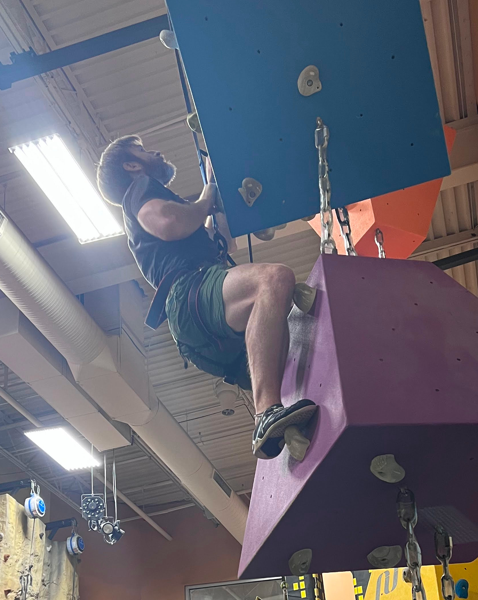

## Hi there! 👋

I'm Justin, a former aircraft mechanic turned software engineer with a passion for knowledge graphs and array programming languages.

### About Me

- ✈️ → 💻 Aircraft Mechanic turned Software Engineer
- 🕸️ Specializing lately in Knowledge Graphs
- 💕 Enthusiast of Array Programming Languages (e.g. APL) and LISPs
  - The "everything is an X" pattern is appealing to me
- ⌨️ Command Line User and Toolmaker
- 🌐 Connecting things with the power of text

### Blog

- If you are interested in any of those things above then you might find [my blog](https://github.com/justin2004/weblog/blob/master/README.md) to be useful.

### Hobbies

When I'm not developing software, you can find me:

- 🛼 Inline skating
- 🧗 Indoor Rock climbing
- 🤸 Jumping on trampolines

<!--  -->
<!--  -->
<!--  -->

<!--  -->

Message me if you want to join me doing any of that stuff! 😄

